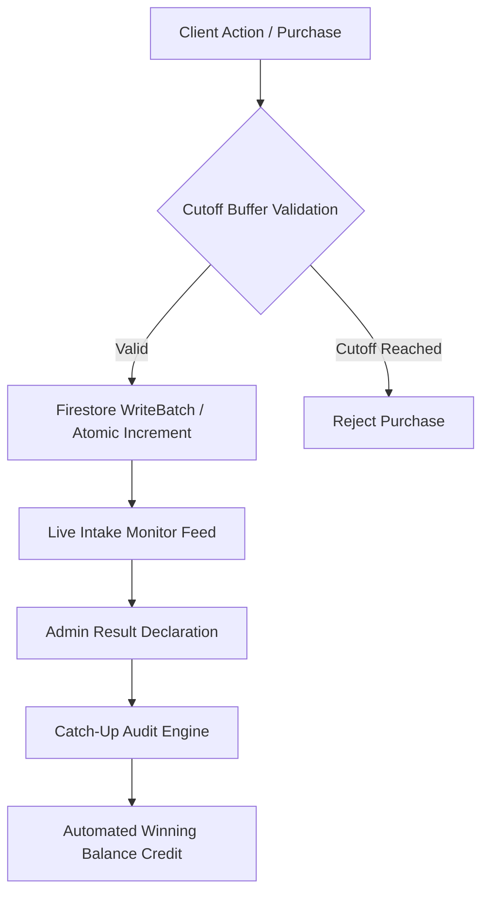

# 💎 SMS Lottery Secretariat Suite - Next-Gen Gaming Platform

An enterprise-grade, high-fidelity lottery management and play platform built for absolute speed, bank-grade security, and complete financial transparency. Engineered with a reactive Firebase NoSQL architecture and a premium glassmorphic UI, it provides a flawless end-to-end bridge between administrative result declarations, automated player payouts, strict financial auditing, and real-time intake monitoring.

---

## ✨ Latest Updates (v2.2)
- **Advanced Sequential SET Engine**: Re-engineered the SET purchase flow to use smart pre-filling, dynamic next-N sequence counting, and independent quantity multipliers. Integrated the SET architecture inline with the main UI for uninterrupted user flows, and successfully ported the capability to the special 3D Lucky Pick slot.
- **QA Tester Fast-Path (God Mode)**: Integrated a seamless auto-creation protocol for a designated mock tester account (`8248222450`). Upon login, it natively bypasses all time-lock constraints (Global Closure, Kerala Early Closure, and strict Slot Closures) and pre-loads a ₹50,000 test balance, allowing for frictionless production auditing and QA without needing to manipulate the database.
- **Global High-Contrast UI**: Upgraded the entire application's visual architecture to feature sharp, dark-contrast borders (`border-gray-900`) across all grids, cards, and admin panels for a premium, highly defined aesthetic.
- **Enhanced Admin Analytics Hub**: Replaced basic dashboard cards with fully interactive, detailed reporting pages for **Today's Tickets**, **Revenue (Custom Range Explorer)**, and **Active Sessions**, complete with static time/type filters.
- **Security & UX Enhancements**: Integrated a seamless password visibility toggle to the login portal to prevent credential input errors.

---

## 🚀 Key Features

### 🎮 For Players
- **Triple-Balance Wallet Architecture**: Advanced financial segregation tracking **Deposited Balance** (for ticket purchases), **Winning Balance** (fully withdrawable winnings), and **Bonus Chips** (promotional, non-withdrawable chips for ticket purchases).
- **Comprehensive Order Details Hub**: A dedicated, real-time analytics page for individual ticket orders. It seamlessly maps dynamic ticket states (Pending, Win, No Win) and perfectly syncs total spending and winning payouts directly from the central Firestore ledger for absolute transparency.
- **Dynamic Betting Matrix**: Comprehensive support for 1D (Single Digit boards A, B, C), 2D (Double Digit combos AB, BC, AC), 3D (ABC), and 4D (XABC) combination patterns across multiple lottery markets.
- **Automated Payout Engine**: Real-time winner detection and instant balance credit using atomic database transactions.
- **Mandatory Payout Verification**: Secure onboarding workflow requiring verified banking details (Account Holder Name, Account Number, IFSC Code, UPI ID) before ticket purchases or withdrawal requests are permitted.
- **Server-Authoritative Time Validation**: Advanced anti-fraud system enforcing strict Indian Standard Time (IST) checks via Firebase server timestamps, preventing users from bypassing slot closures by manipulating local device clocks.
- **High-Fidelity Ledger & History**: Professional, receipt-style ticket history and a dedicated **Transaction History** hub with live status tracking (Pending, Approved, Rejected, Won, Active).
- **Referral Engine**: Integrated referral system rewarding users with instant bonus chips upon successful friend registration.
- **Pull-To-Refresh Reactivity**: Custom-built mobile touch gesture system for instant, on-demand data synchronization without requiring page reloads.

### 🛡️ For Administrators
- **Unified Financial Command Center**: Real-time management boards for deposit approvals and withdrawal requests, featuring tabbed interfaces separating **Pending Verification** from **Permanent Audit History**.
- **Advanced Audit Trail & Oversight**: Comprehensive administrative logging capturing transaction IDs, exact timestamps, banking metadata, and custom rejection reasons for full accountability.
- **Time-Locked Announcements & Market Control**: Secure result declaration engine with built-in validation for market-specific slots, including automated **Kerala Lottery Early Closure (02:00 PM)** rules and a master switch for global ticket sales.
- **Live Intake Monitor & High-Frequency Analytics**: Real-time analysis of number frequency mapping and combination volume tracking across active draw sessions. Features top-15 high-frequency combination rankings, board-specific filtering (A, B, C, AB, BC, AC), and price-tier breakdowns (e.g., ₹12, ₹28, ₹30, ₹55, ₹60 for 3D; ₹20, ₹50, ₹100 for 4D).
- **Comprehensive Admin Reporting**: Advanced PDF and CSV export tools (`jspdf`, `jspdf-autotable`) capable of generating dynamic **Revenue Reports**, **User Growth Analytics**, and **Wallet Transaction Logs** with custom time-range filtering directly from Firestore. Features client-side querying to eliminate indexing bottlenecks.
- **Deep-Dive User Management & Metadata**: Detailed player profiles allowing administrators to monitor individual liquidity, adjust triple-balance allocations, update security parameters, review transaction histories, and track exact Account Registration timestamps.
- **Global Brand Management**: Dedicated Admin Settings to instantly broadcast Global Application Theme colors across all connected clients via live Firebase synchronization without page reloads.
- **Database Migration & Synchronization**: Support for zero-downtime Firebase Authentication migration across projects, perfectly retaining legacy SCRYPT password hashes (`firebase-tools auth:export/import`) and seamlessly updating user UUIDs.
- **Version & Build Transparency**: Global `APP_VERSION` and `BUILD_VERSION` config constants displayed seamlessly across user profile settings and admin dashboards for clear deployment tracking, supporting side-by-side local APK testing.

---

## 🛠️ Technology Stack

- **Frontend**: React.js (Vite) with highly optimized Context API (`AuthContext`, `CartContext`, `PaymentContext`) for modular state management.
- **Backend / Database**: Google Firebase Firestore (NoSQL) for real-time synchronization and live query listeners (`onSnapshot`).
- **Authentication**: Firebase Auth with role-based access control (Admin vs. Verified Member) and dynamic multi-identifier resolution.
- **Styling & Aesthetics**: Tailwind CSS integrated with a dynamic, vibrant multi-color design system. Features lottery-specific brand color coding (e.g., Red for Dear, Green for Kerala), fluid glassmorphism, and instant Global Theme Control for core UI accents.
- **Icons**: Lucide-React for clean, scalable vector iconography.
- **Export & Reporting**: jsPDF and jsPDF-AutoTable for client-side official document generation.

---

## 📦 Architecture Highlights



- **Catch-Up Audit Engine**: A resilient automated auditing system that ensures winning tickets are accurately processed and credited even if a user logs in days after a result is declared.
- **Standardized Market Cutoff Logic**: Precise draw schedules (DEAR at 01:00 PM, 06:00 PM, 08:00 PM; KERALA at 03:00 PM) enforced with automated 5-minute pre-draw cutoff buffers (`getCutoffTime`) and dynamic administrative overrides.
- **Zero-Payout Elimination & Safe Matching**: The evaluation engine executes cascading partial-match validation (XABC -> ABC -> BC -> C) with strict `> 0` payout gating to instantly discard partial matches against disabled or zero-reward tiers.
- **Legacy Schema Compatibility**: Integrated fallback parsers map legacy array-based prize structures into the modern `v2` Object schema seamlessly without data corruption.
- **Secure Withdrawal Escrow Protocol**: Implements an instant escrow deduction methodology. When a user requests a withdrawal, funds are instantly secured/deducted to prevent double-spending vulnerabilities or negative balances. If an admin rejects the request, an automated live refund is instantly credited back to the user's active wallet.

---

## 🔒 Security & Policy Governance

- **Strict Firestore Security Rules**: Fully sandboxed database access ensuring that unauthenticated users are blocked, standard users can only read/write their own isolated ticket and transaction records, and administrative actions are strictly restricted via server-side role validation (`isAdmin()`).
- **Development Fallback Mode**: Graceful snapshot error handling allows local development testing to continue bypassing snapshot crashes if Firebase propagate delays block the connection. 
- **Time-Fraud Elimination**: Implements an immutable UTC/IST Server Timestamp (`serverTimestamp()`) architecture for all ledger entries, ensuring that device clock spoofing cannot affect transaction ledgers or slot cutoff bypasses.

---

## 🌐 Advanced Operations & PWA Support

- **Progressive Web App (PWA) Ready**: Built to operate identically across Desktop browsers and Mobile form factors, with native-like touch gestures, modal overlays, and pull-to-refresh synchronization.
- **Dynamic Configuration Layer**: The `src/config.js` framework allows instant swapping of build versions, target environments, and operational constants without requiring deep codebase changes.

## 🚦 Getting Started

### Prerequisites
- Node.js (v18+ recommended)
- Firebase Account & Project Configuration (Firestore, Auth)

### Installation
1. Clone the repository:
   ```bash
   git clone [repository-url]
   ```
2. Install dependencies:
   ```bash
   npm install
   ```
3. Configure Environment:
   Update `src/firebase.js` with your active Firebase project credentials and configuration object.

4. Launch Development Server:
   ```bash
   npm run dev
   ```
5. Production Web Build:
   ```bash
   npm run build
   ```

### 📱 Android APK Build (Capacitor)
This project uses Ionic Capacitor to compile the web application into a native Android APK.

1. Ensure your production build is fresh:
   ```bash
   npm run build
   ```
2. Sync the web assets to the Android project:
   ```bash
   npx cap sync android
   ```
3. Open Android Studio to build the APK, or run it directly on a connected device:
   ```bash
   npx cap open android
   # OR
   npx cap run android
   ```
*Note: To update the app version, bump the version code in `android/app/build.gradle` and the `APP_VERSION` in `src/config.js` before syncing.*

---

## 📜 Maintenance & Diagnostic Logging

The platform includes a robust **Diagnostic Logger** for real-time monitoring and debugging. Open the browser developer console (F12) to inspect live operational feeds:
- `[AUDIT]`: Live ticket scanning and catch-up payout logs.
- `[CHECK]`: Real-time match verification between active user tickets and newly declared results.
- `[SYNC]`: Administrative Monitor data intake feed status and live ledger updates.
- `[Identity Dispatch]`: Authentication and recovery link routing logs.

---

*Engineered with precision for secure, transparent, and high-performance digital gaming.*
